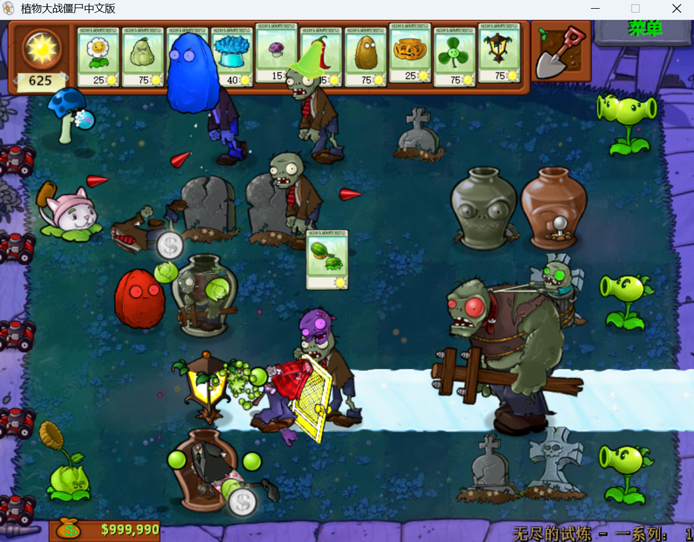

  <a href="./README.md">English</a> | 简体中文

# Plants vs. Zombies：砸罐子无尽版改版

这是一个针对《植物大战僵尸》（Plants vs. Zombies）一代 PC 版制作的改版仓库。

本项目在原版基础上，对解谜模式中的「砸罐子无尽版」（Vasebreaker Endless）进行了大量修改，包括全新的关卡机制、特殊僵尸、强化植物、Boss 战和奇遇关卡等内容。

  

---

## 运行要求

本改版需要借助 Cheat Engine（简称 CE）运行。

- **Cheat Engine 官网：** [https://www.cheatengine.org/](https://www.cheatengine.org/)
- **游戏版本：**《植物大战僵尸》一代 PC 版
- **修改文件：** 仓库中提供的 `.CT` 文件

---

## 难度版本

仓库提供了三个不同难度的版本：

| 版本 | 难度 | 适合玩家 | 难度评价 |
| --- | --- | --- | --- |
| `older` | 简单 | 推荐首次体验时选择 | 坚持20关以上已经很不容易，40关以上就是大佬！ |
| `teen` | 中等 | 适合熟悉玩法的玩家 | 30关以上是大佬，40关以上已经达到顶尖水平！ |
| `hell` | 困难 | 适合追求极限挑战的玩家 | 挺过10关就是大佬，20关以上已经超过笔者！ |

---

## 快速开始

1. 下载并安装 Cheat Engine。
2. 启动《植物大战僵尸》。
3. 使用 Cheat Engine 打开游戏进程。
4. 导入仓库中的 `.CT` 文件，并选择想要体验的版本。首次游玩推荐选择 `older`。
5. 在游戏中进入「砸罐子无尽版」。
6. 依次按下以下快捷键：

   - `Ctrl + J`：初始化修改
   - `Ctrl + K`：一键进入改版模式

7. 重新开始游戏，即可体验改版后的「砸罐子无尽版」。

---

## 快捷键

快捷键可以在 Cheat Engine 中自行修改。导入 `.CT` 文件后，可以查看其中的地址和更多快捷键设置。

| 快捷键 | 功能 |
| --- | --- |
| 长按 `1（!）` | 慢速运行 |
| 长按 `2（@）` | 加速运行 |
| `Ctrl + J` | 初始化／从改版恢复至原版 |
| `Ctrl + K` | 从原版进入改版模式 |
| `Ctrl + L` | 秒杀所有僵尸 |
---

# 主要改动

## 关卡机制

### 基础规则

戴夫通过梦境预知了邪恶罐子的到来，因此提前在院子里布置了特殊机关：

- 每一关都会随机透视几个罐子。
- 每一行都会准备一辆一次性除草小推车。
- 罐子中的植物种类更加随机。
- 植物可以无视常规种植限制。

植物甚至可以种植在以下位置：

- 已经种有植物的格子
- 存在罐子的格子
- 长有墓碑的格子
- 存在冰道的格子

### 危机关卡

游戏中共有两次月圆之夜：

- **第10关：第一次月圆之夜**
  - 进入危机关卡。
  - 罐子会压迫至第二列。

- **第20关：第二次月圆之夜**
  - 再次进入危机关卡。
  - 罐子会压迫至第一列。
  - 从这一关开始，此后每一关的罐子都会压迫至第一列。

危机关卡仅有第10关和第20关。

在危机关卡中，植物死亡后有概率生成墓碑，使植物原本的「亡语」效果失效。

  

### Boss 战

第30、40、50……关都会出现 Boss 战。

Boss 关卡中会出现隐藏着红眼巨人的特殊罐子，请务必谨慎处理。

### 奇遇关卡

> 看起来今天的罐子里躲进去了不少稀客！

奇遇关卡会出现在第5、15、25……关。

关卡特点：

- 所有植物均为金盏花。
- 所有僵尸均为雪人僵尸和小丑僵尸。
- 主要用于补充阳光和资源。

### 追星关卡

> 哥哥来院子里开演唱会了！

关卡特点：

- 罐子中的植物全部为魅惑菇。
- 僵尸全部为舞王僵尸、伴舞僵尸和巨人僵尸。

### 卡片保留

如果通关时还有未使用的植物卡片，可以用鼠标单击将其「捏住」，然后带到下一关继续种植。

但是，Boss 关卡前夕无法保留卡片，因为此时需要领取钱袋。

---

## 僵尸改动

> 数年累月的食脑经历，让一些僵尸变得更具攻击性。  
> 它们或许早已不再是那些步履蹒跚、营养不良的呆子了！

除以下僵尸外，其他僵尸都有可能出现在罐子中：

- 潜水僵尸
- 海豚骑士僵尸
- 气球僵尸
- 僵王博士

其中也包括红眼巨人。由于它实在过于邪恶，会将藏身的罐子染成黑色，每一关都要重点关注黑色罐子的位置。

### 旗帜僵尸

进化为令人戴夫闻风丧胆的「吐舌旗帜」：

- 移动速度大幅提升
- 攻击力大幅提升

### 路障僵尸

进化为「反物质路障」！

它意外在路上捡到了一顶反物质路障。戴上沉重的路障后，虽然移动速度有所降低，但防御能力大幅提升。反物质的长期侵蚀也让它变得更加暴躁，攻击力显著增强。

**弱点：** 控制类子弹。

### 铁桶僵尸

- 铁桶耐久度略微提升。
- 一只窝瓜可能无法直接将其秒杀。
- 炸弹类植物的杀伤力依然足够。

### 读报僵尸

这位看起来慈祥的数学家变得更加危险：

- 攻击力增加
- 报纸更加脆弱
- 报纸被破坏后会进入发狂状态
- 发狂后移动速度大幅提升

一定要小心失去报纸后的读报僵尸！

### 铁栅门僵尸

进化为「金窗门僵尸」！

它在入侵一位富豪的家后，顺手带走了一扇金光闪闪的黄金窗户，防御力因此大幅提升。

**弱点：**

- 反向双发射手
- 投手类植物

### 小丑僵尸

没错，即使来到了砸罐子的世界，它依然是个令人憎恨的家伙。

- 击杀后奖励 `100` 阳光
- 奇遇关卡中除外

### 矿工僵尸

进化为「讨薪矿工」！

生前被老板长期拖欠工资，使它练就了极快的移动速度和攻击速度。

不过值得庆幸的是——它不吃脑子。

### 雪人僵尸

它和小丑僵尸一起登上了戴夫的悬赏名单：

- 击杀后奖励 `100` 阳光
- 逃跑速度比原版更快
- 攻击力更高
- 胃口也变得更好

请尽快将其击杀，否则它很快就会逃走。

### 投篮僵尸

热爱唱、跳和篮球的它，在经历一场无情的车祸后，只能坐在轮椅上行动。

在获得蔡徐坤的指点后：

- 投篮速度大幅提升
- 攻击力有所降低

它并无意伤害植物，只是喜欢打篮球而已。

### 小鬼僵尸

进化为「饥饿小鬼」：

- 攻击力提升
- 移动速度提升

这个贪吃又饥饿的小鬼头会比原版更加危险。

### 巨人僵尸

- 每经过5关，会增加一个白眼巨人，同时减少一株植物。
- 再经过5关，白眼巨人会进化为红眼巨人。

### 植物僵尸

- 豌豆类植物僵尸的子弹伤害提升。
- 窝瓜僵尸和辣椒僵尸的移动速度大幅提升。

> **辨认提示：**
>
> - 植物僵尸在罐子中被照亮后，会显示为普通僵尸的外观。
> - 真正的普通僵尸在罐子中会显示为带着鸭子救生圈的形象。
>
> 可以通过这一特点区分植物僵尸和普通僵尸。

---

## 植物改动

> 经过戴夫的科研改造，植物的战斗力得到了提升，一些植物甚至改变了原有特性！

| 植物 | 改动 |
| --- | --- |
| 土豆类植物 | 威力大幅提升，可以秒杀任何僵尸 |
| 寒冰射手 | 射速提升 |
| 大嘴花 | 体型和生命值提升，可以承受多次巨人的锤击，是巨人一族的宿敌 |
| 大喷菇、忧郁蘑菇 | 伤害提升 |
| 胆小菇 | 射速大幅提升，但依然胆小；害怕撑杆僵尸和小鬼僵尸等突进型敌人 |
| 三线射手 | 获得猫尾草的指点，可以发射尖刺；尖刺有小概率击退僵尸 |
| 火炬树桩 | 火焰豌豆的伤害大幅提升 |
| 高坚果 | 可以承受多次巨人的锤击；死亡后会像寒冰菇一样冰冻全场 |
| 三叶草 | 可以将僵尸向后吹退数格，并附带冰冻减速效果 |
| 杨桃 | 发射的子弹有50%概率魅惑僵尸，需要注意种植角度 |
| 卷心菜投手 | 射速大幅提升 |
| 叶子保护伞 | 生命值大幅提升；死亡后会像火爆辣椒一样燃烧一整行 |
| 金盏花 | 随机产出任意植物卡片，不包括向日葵和阳光菇；可能产出玉米加农炮等紫卡 |
| 地刺王 | 可以无限次抵挡巨人的锤击 |

---

## 生存建议

以下技巧或许能帮助你坚持得更久：

1. **充分利用控制效果**

   寒冰减速、黄油定身和尖刺击退组合在一起，可以形成非常强大的控制链，尤其克制「反物质路障」这类移动速度较慢的僵尸。

2. **利用巨人的体型**

   巨人僵尸体型巨大，可以尝试在它身后的格子埋下土豆雷，将其直接炸死。

3. **用魅惑僵尸对付巨人**

   巨人僵尸最大的弱点之一就是被魅惑的僵尸。面对僵尸的啃咬，巨人不会主动反抗。

4. **合理使用金盏花**

   金盏花可以作为巨人僵尸、撑杆僵尸和窝瓜僵尸的垫材，为其他植物争取输出时间。

5. **提前侦察 Boss 关卡**

   Boss 关卡中的罐子会压迫至前列，僵尸很容易迅速突进家门。建议提前购买路灯花，用来照亮前排罐子。

6. **重点观察黑色罐子**

   黑色罐子中可能藏着红眼巨人。开罐前务必提前准备足够的控制和爆发伤害。

---

## 注意事项

- 请先执行 `Ctrl + J` 完成初始化，再按下 `Ctrl + K` 进入改版模式。
- 如果修改没有生效，请检查 Cheat Engine 是否已正确附加到游戏进程。
- 不同游戏版本之间可能存在兼容性差异。
- 首次体验建议选择难度较低的 `older` 版本。
- 如果想获得更完整的贴图体验，可以替换游戏目录中的 `main.pak` 文件。
- 替换游戏文件前，建议先备份原始文件。
